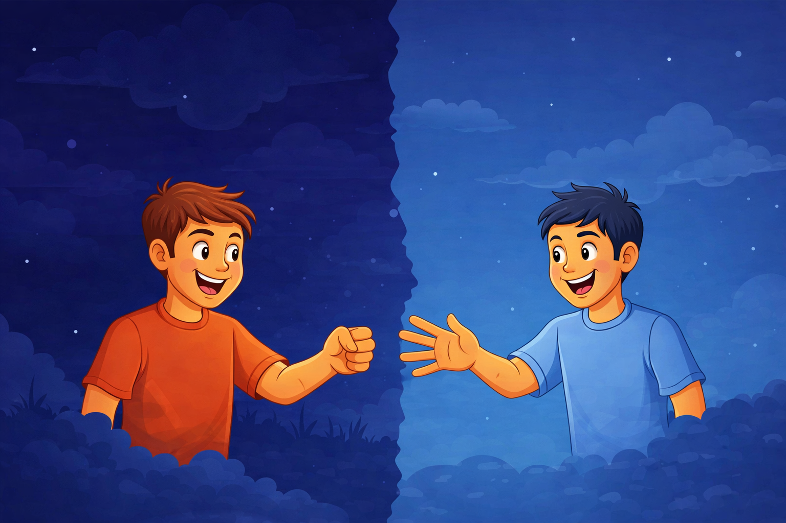

# Rock Paper Scissors

A dynamic, interactive Rock Paper Scissors game played against the computer. This project features smooth animations using the GreenSock Animation Platform (GSAP), sound effects, and a realistic "thinking" phase for the opponent.

## 📸 Game UI

> _The interface features animated hands that enter from the sides, a dynamic scoreboard, and interactive controls._

## 🌟 Features

- **Interactive Gameplay:** Play the classic game against a randomized computer opponent.
- **GSAP Animations:** Smooth entrance and exit animations for hand gestures.
- **Opponent Logic:** The computer simulates a "thinking" phase by cycling through options before revealing its choice.
- **Score Tracking:** Real-time score updates for both the player and the computer.
- **Sound Effects:** Audio feedback when interacting with buttons.
- **Input Locking:** Prevents spamming buttons during the animation phase to ensure game stability.

## 🛠️ Technologies Used

- **HTML5**
- **CSS3**
- **JavaScript (ES6+)**
- **[GSAP](https://greensock.com/gsap/)** - Used for handling the hand animations and opacity transitions.

## Copyright

Copyright &copy; 2025 Khem Raj Budhathoki
